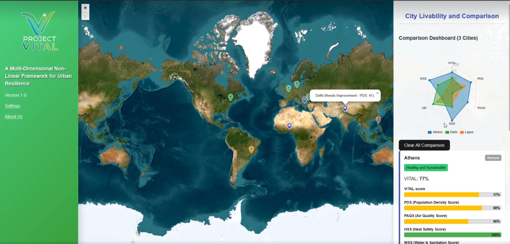
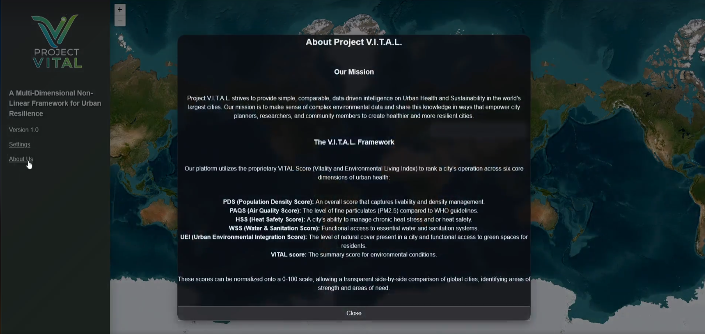

# Project VITAL
### A Multi-Dimensional Hybrid Scale Framework for Urban Resilience

## Overview
**Project VITAL** (Vitality, Infrastructure, Temperature, Air, and Livability) is a framework using a multi-dimensional scoring system to assess urban resilience and livability at the **city scale**. By integrating multiple data sources—including *NASA (MODIS, Earthdata, SEDAC), Copernicus (ERA5-Land), WorldPop, Local Climate Zones (LCZ), World Health Organization (WHO)* datasets—VITAL transforms complex environmental and infrastructural variables into **easily interpretable scores**.  

The framework applies multiple mathematical transformation and aggregation methods, such as **linear, logarithmic, exponential, and sigmoid scaling**, to account for non-linear relationships across sub-metrics. These scores communicate how cities respond to environmental stressors and support human wellbeing. VITAL is **modular and forward-thinking**, allowing the integration of new metrics as data and methods evolve, making it a **dynamic tool for sustainable urban development**.

---

## How VITAL is Different

**City-Centric Scoring Metric** – VITAL focuses on a **city-level scale**, capturing environmental stressors and infrastructure challenges where they directly affect human populations.  

**Advanced Mathematical Aggregation** – Multiple transformations across sub-metrics capture **non-linear changes**, reflecting complex interactions between environmental and infrastructural factors.  

**Modular and Future-Proof** – New metrics, formulas, and methodologies can easily be added, ensuring VITAL remains **relevant and adaptable** as urban data evolves.  

---

## Sub-Metrics

**PM2.5 Air Quality Score (PAQS)** – Measures exposure to fine particulate matter affecting respiratory and cardiovascular health.  

**Chronic Heat Stress Score (CHSS)** – Captures long-term heat exposure and its impact on human wellbeing.  

**Urban Environmental Integration Score (UEI)** – Assesses the fraction of green areas and its accessibility to people to be used as leverage for detecting necessary improvements in environmental location planning and strategies.  

**Population Density Score (PDS)** – Reflects city density and its influence on resource strain and exposure to stressors.  

**Water and Sanitation Score (WSS)** – Evaluates access to clean water and sanitation infrastructure.

---

## Features
**Interactive Map with Pins**: Explore cities worldwide with clickable map markers providing detailed breakdowns of environmental and infrastructural scores.

**Radar Chart Comparison**: Compare multiple cities side-by-side using radar charts to visualize resilience and livability dimensions.

**Advanced Analysis & Visualizations**: Access in-depth insights with data-driven charts, heatmaps, and trend analyses for better decision-making.

**Efficient User Interface (UI)**: Navigate a streamlined and responsive design optimized for clarity, performance, and accessibility.

---

## Methodology Summary

**Project VITAL** collected high-resolution data from multiple sources, including **NASA (MODIS), Copernicus ERA5-Land, WorldPop, Local Climate Zones, and WHO datasets**. Shapefiles were processed and clipped into rasters containing the datasets, while some data were curated from existing sources.  

### Sub-metric Processing

- **PM2.5 Air Quality (PAQS)** – Aerosol optical depth (AOD) data from MODIS, MISR, SeaWiFS, and VIIRS were used to estimate annual PM2.5 concentrations.  

- **Chronic Heat Stress (CHSS)** – Copernicus ERA5-Land daily temperature and 2m dewpoint data were used to compute relative humidity and heat exposure metrics.  

- **Urban Environmental Integration (UEI)** – Derived from a map of Local Climate Zones by Ruhr University Bochum’s measures of green and infrastructure fractions and assessed using the 30% Green Cover and 300m Access (from 3-30-300) rule by the Nature Based Solutions Institute.

- **Population Density (PDS)** – Calculated from WorldPop Global High Resolution Population Denominators to measure exposure to density-based stressors.  

- **Water and Sanitation Score (WSS)**  
  - **W:** Safe drinking water access (SDG 6.1.1), sourced from WHO/UNICEF JMP and supplemented by NASA Earthdata for water quality.  
  - **S:** Safely managed sanitation access (SDG 6.2.1), using WHO/UNICEF JMP, NASA SEDAC, and Copernicus GHSL for dense clusters.  
  - **T:** Wastewater treatment (SDG 6.3.1), sourced from UN-Habitat, FAO AQUASTAT, UN-Water, and NASA Earthdata monitoring.

All sub-metrics are **transformed using linear, logarithmic, exponential, and sigmoid functions** to capture non-linear relationships, then **averaged via arithmetic mean** to compute the overall **VITAL Score**. This provides a **policy-relevant, interpretable urban resilience metric**.

---

## Limitations and Future Improvements

**VITAL** presents a city-level assessment that is **robust** and consistent with policy needs but is designed to **advance over time**. Upcoming iterations will incorporate **micro-level variation** within cities (e.g., localized pollution hotspots, micro-climates, and high-density populations) to improve precision. Expanding **global coverage to all cities** is a priority, and the **scoring methodology will be formally validated** to strengthen scientific rigor. As more **frequent or real-time data** become available, VITAL will adapt to changing urban conditions, becoming an **increasingly dynamic tool** for urban planners, policymakers, and researchers.

---

## Team

- **Bulaong, Ross Andrew** (Backend Data Extraction, Research)  
- **Centeno, Clark Kent** (Frontend, Graphic Design, Functionalities)  
- **Galan, Irick Marvin** (Backend Data Extraction, Research)  
- **Loterte, David** (Frontend, Graphic Design, Functionalities)  
- **Rosario, Redjohn** (Backend Data Extraction, Research)  
- **Tuzara, John Paul** (Backend Data Extraction, Research)  

---

## Demo Screenshots

### Home Screen

### UI and Map

### About Us

---

## Tech Stack

For Frontend:
**HTML**
**CSS**
**Javascript**

For Backend:
**Python**

---
## Link to Documentation and Backend Scripting

The backend of Project VITAL is in a separate repository named 'Project VITAL Data Pipeline'. To access, click this link: https://github.com/RossUsesGit/Project-VITAL-Data-Pipeline.git
---

## References

- **NASA MODIS** – Global Annual PM2.5 Grids from MODIS, MISR, SeaWiFS and VIIRS Aerosol Optical Depth (AOD), 1998-2022, V5.GL.04 [(https://www.earthdata.nasa.gov/data/catalog/sedac-ciesin-sedac-sdei-gwrpm25-mmsvaod-5gl04-5.04)]([https://modis.gsfc.nasa.gov](https://www.earthdata.nasa.gov/data/catalog/sedac-ciesin-sedac-sdei-gwrpm25-mmsvaod-5gl04-5.04))  
- **Copernicus ERA5-Land** – ERA5-Land post-processed daily statistics from 1950 to present [[https://cds.climate.copernicus.eu]([https://cds.climate.copernicus.eu/datasets/derived-era5-land-daily-statistics?tab=overview)]
- **WorldPop** – Global High Resolution Population Denominators. [https://www.worldpop.org](https://www.worldpop.org)  
- **Local Climate Zones (LCZ)** – Urban climatology data for city-scale environmental analysis. [https://lcz-generator.rub.de/global-lcz-map]([https://lcz-generator.rub.de/global-lcz-map])  
- **World Health Organization (WHO)** – Drinking water, sanitation, and health data. [https://www.who.int](https://www.who.int)  
- **WHO/UNICEF Joint Monitoring Programme (JMP)** – Water and sanitation indicators. [https://washdata.org](https://washdata.org)  
- **Global Burden of Disease Studies** – Epidemiological data on PM2.5 health impacts. [https://www.healthdata.org/gbd](https://www.healthdata.org/gbd)  
- **Environmental Performance Index (EPI)** – Yale & Columbia University, 2020. [https://epi.yale.edu](https://epi.yale.edu)  
- **Environmental Livability Index (ELI)** – Aurassure, 2025. [https://aurassure.com/2025/08/05/environmental-livability-index/](https://aurassure.com/2025/08/05/environmental-livability-index/)
